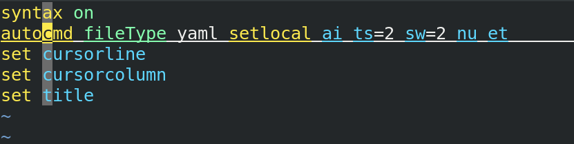

# README

I'm writing more Ansible playbooks and yaml is such a big part of it. Although, I usually write playbooks in VSCode, for the RHCE (Red Hat Certified Engineer) exam, you'll rely on Vim exclusive (or nano, but that's not what I'm referring to).

Here are my .vimrc settings. Although there are other examples of .vimrc out there, this works for me. Here is an explanation of the settings.

## syntax on
Turn syntax highlighting on according to the current value of fileType which in this case is yaml

## [autocmd](https://vimhelp.org/autocmd.txt.html#%3Aautocmd)
Setting commands to be automatically executed when reading or writing a file.

## fileType yaml
Setting vim to recognize yaml filetypes.

## setlocal
Setting the local (not global) options in your current window/buffer.

## [ai](https://vimhelp.org/options.txt.html#%27autoindent%27)
Auto indent (ai) copies the indent from the current line when starting a new line.

## [ts](https://vimhelp.org/options.txt.html#%27tabstop%27)
Tabstop is the number of spaces that a tab counts for. _ts=2 is 2 spaces in a tab._

## [sw](https://vimhelp.org/options.txt.html#%27shiftwidth%27)
Shift width is the number of spaces to use for each step of auto indent (ai).

## [nu](https://vimhelp.org/options.txt.html#%27number%27)
Prints the line number in front of each line. This really makes it easier to troubleshoot errors.

## [et](https://vimhelp.org/options.txt.html#%27expandtab%27) 
Expand tab uses the appropriate number of spaces to insert a tab.

## [set cursorline (cul)](https://vimhelp.org/options.txt.html#%27cursorline%27)
Shows the line that the cursor is on with horizontal line 

## [set cursorcolumn (cuc)](https://vimhelp.org/options.txt.html#%27cursorcolumn%27)
Shows the column that the cursor is in. My favorite setting, tbh.

## [set title](https://vimhelp.org/options.txt.html#%27title%27)
Sets the title of the terminal window to the name of the file you're currently editing.

